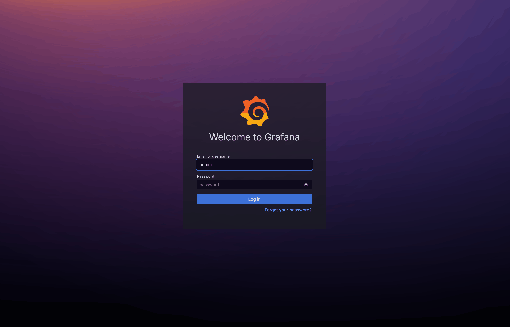

# 🛡️ Helm Deploy Lab – Instant Kubernetes App Deployment


This repository demonstrates a **real-world monitoring stack deployment** using Helm on a local Kubernetes cluster (Minikube or K3s).
It’s designed to showcase production-ready DevOps workflows — even in a small/local environment.

> Author: **Nuntin Padmadin**  
> GitHub: [github.com/Nuntin](https://github.com/Nuntin)

---

## 📆 Tech Stack

| Component     | Description                             |
|---------------|-----------------------------------------|
| K3s / Minikube| Lightweight Kubernetes distributions     |
| Helm          | Kubernetes package manager               |
| Prometheus    | Metrics and alerting                     |
| Grafana       | Visualization and dashboards             |
| Alertmanager  | Notification and alert routing           |

---

## 📁 Project Structure

```
helm-deploy-lab/
├── values-prod.yaml               # Helm values for production-like settings
├── k3s-bootstrap.sh               # Script to install K3s and deploy monitoring
├── uninstall.sh                   # Script to uninstall monitoring stack
├── scripts/
│   └── deploy-local.sh            # Minikube deployment automation
├── .gitlab-ci.yml                 # GitLab CI pipeline config
├── README.md                      # Main description and usage
├── LICENSE                        # MIT license
├── docs/
│   ├── bootstrap.md               # K3s-based deployment guide
│   ├── minikube-monitoring.md     # Minikube deployment walkthrough
│   ├── deploy.md                  # General deployment guide
│   ├── uninstall.md               # Uninstall documentation
│   ├── grafana-dashboards.md      # Dashboard examples and insights
│   ├── scenarios.md               # Real-world use cases
│   └── images/
│       ├── grafana-sli.png
│       ├── prometheus-overview.png
│       └── grafana-lab-demo.gif   # GIF demo of Grafana in action
```

---

## 🛠️ Quick Start (Minikube Example)

```bash
# Start Minikube
minikube start --memory=4096 --cpus=2

# Add Helm repo
helm repo add prometheus-community https://prometheus-community.github.io/helm-charts
helm repo update

# Install the monitoring stack
helm upgrade --install monitor prometheus-community/kube-prometheus-stack \
  -f values-prod.yaml

# Forward Grafana port (default: 3000)
kubectl port-forward svc/monitor-grafana 3000:80 -n default
```

---

## 🔐 Grafana Login

```bash
kubectl get secret monitor-grafana -o jsonpath="{.data.admin-password}" | base64 -d
# username: admin
```

---

## 📚 Documentation

| Topic                  | Path                                 |
|------------------------|--------------------------------------|
| K3s Bootstrap Guide    | docs/bootstrap.md                    |
| Minikube Walkthrough   | docs/minikube-monitoring.md          |
| Generic Deploy Guide   | docs/deploy.md                       |
| Grafana Dashboards     | docs/grafana-dashboards.md           |
| Uninstall Steps        | docs/uninstall.md                    |
| Use Case Scenarios     | docs/scenarios.md                    |

---

## 📸 Screenshots & Demos

<p align="center">
  
  <br><em>Grafana Login + Dashboard Demo</em>
</p>

<p align="center">
  
  <br><em>Grafana SLI Dashboard</em>
</p>

<p align="center">
  
  <br><em>Prometheus Metrics Overview</em>
</p>

---

## 🌟 Why This Matters

Even without cloud budget or large infra, you can demonstrate **DevOps readiness** through local deployment labs. 
This lab shows:

- Helm-based production installs
- Working Kubernetes setup (Minikube/K3s)
- Real monitoring with Grafana + Prometheus
- Documentation-first and CI-driven development

---

## 🤝 License

MIT — see [LICENSE](LICENSE)

---

## 👤 About Me – DevOps Engineer (Open to Work)
Hi, I'm Nuntin – a DevOps / Infrastructure Engineer from Thailand 🇹🇭
Currently looking for new opportunities in the field of DevOps and Cloud Infrastructure.

- Terraform, Ansible, GitLab CI/CD, Docker, Kubernetes
- AWS: EC2, S3, IAM, RDS, VPC, CloudFront, Route53
- Real use-case demo → see this repo!

🏠 [All My DevOps Labs](https://github.com/nuntin?tab=repositories)

💼 LinkedIn: [linkedin.com/in/nuntin-padmadin-97b708145](https://www.linkedin.com/in/nuntin-padmadin-97b708145/)

📧 Email: nuntin.p@gmail.com

---

**SEO Keywords:**  
`helm lab`, `k8s monitoring minikube`, `devops portfolio`, `grafana prometheus helm`, `k3s ci demo`, `open to work devops`

---