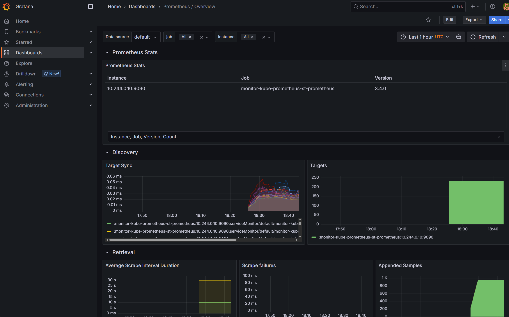

# 🚀 Helm Deploy Lab

This repository demonstrates a **real-world monitoring stack deployment** using Helm on a local Kubernetes cluster (Minikube as default). 
It’s designed to showcase production-ready DevOps workflows — even without cloud infrastructure.

> Author: **Nuntin Padmadin**  
> GitHub: [github.com/Nuntin](https://github.com/Nuntin)

---

## 📦 Tech Stack

| Component     | Description                             |
|---------------|-----------------------------------------|
| Minikube      | Lightweight Kubernetes for local testing |
| Helm          | Kubernetes package manager               |
| Prometheus    | Metrics and alerting                     |
| Grafana       | Visualization and dashboards             |
| Alertmanager  | Notification and alert routing           |

---

## 📁 Project Structure

```
helm-deploy-lab/
├── values-prod.yaml               # Helm values for production-like settings
├── README.md                      # Main description and usage
├── docs/
│   ├── minikube-monitoring.md     # Minikube deployment walkthrough (main setup)
│   ├── bootstrap.md               # Optional: K3s/Linux bootstrap guide
│   ├── grafana-dashboards.md      # Dashboard examples and insights
│   └── images/
│       ├── grafana-sli.png
│       └── prometheus-overview.png
```

---

## 🛠️ Quick Start (Minikube)

```bash
# Start Minikube
minikube start --memory=4096 --cpus=2

# Add Helm repo
helm repo add prometheus-community https://prometheus-community.github.io/helm-charts
helm repo update

# Install the monitoring stack
helm upgrade --install monitor prometheus-community/kube-prometheus-stack \
  -f values-prod.yaml

# Forward Grafana port (default: 3000)
kubectl port-forward svc/monitor-grafana 3000:80
```

---

## 🔐 Grafana Login

```bash
kubectl get secret monitor-grafana -o jsonpath="{.data.admin-password}" | base64 -d
# username: admin
```

---

## 📚 Documentation

| Topic                      | Path                                 |
|----------------------------|--------------------------------------|
| Minikube Walkthrough       | docs/minikube-monitoring.md          |
| Grafana Dashboards         | docs/grafana-dashboards.md           |
| K3s (optional, Linux only) | docs/bootstrap.md                    |

---

## 📸 Screenshots

<p align="center">
  
  <br><em>Grafana SLI Dashboard</em>
</p>

<p align="center">
  
  <br><em>Prometheus Metrics Overview</em>
</p>

---

## 🎯 Why This Matters

Even without cloud budget or large infra, you can demonstrate **DevOps readiness** through local deployment labs. 
This lab shows:

- Helm-based production installs
- Working Kubernetes setup (Minikube on Windows)
- Real monitoring with Grafana + Prometheus
- Documentation-first mindset

---

## 🤝 License

MIT — see [LICENSE](LICENSE)