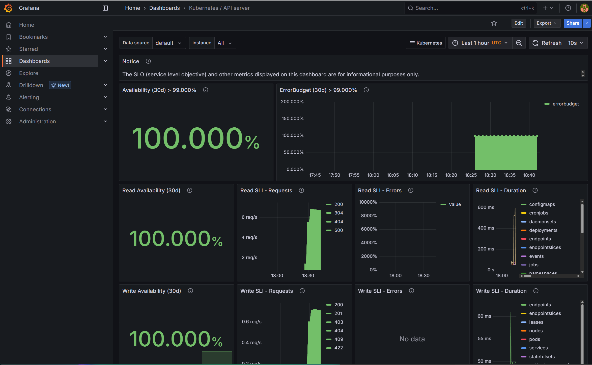
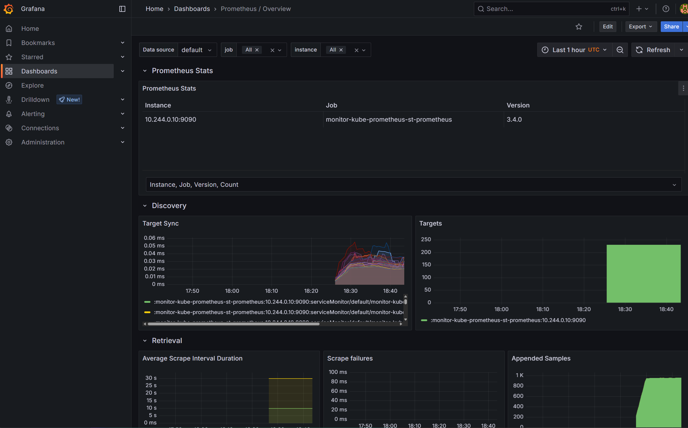

# 📊 Monitoring Stack Overview (Minikube)

This project demonstrates how to deploy a full monitoring stack using Helm on Minikube — a lightweight Kubernetes distribution for local development.

👉 **Full step-by-step setup:** [docs/bootstrap.md](./bootstrap.md)

---

## 🧱 Components

| Tool          | Description                           |
|---------------|---------------------------------------|
| Minikube      | Local Kubernetes cluster              |
| Helm          | Kubernetes package manager            |
| Prometheus    | Metrics collection & alerting         |
| Grafana       | Visualization and dashboards          |
| Alertmanager  | Alert processing                      |

---

## 📸 Dashboard Screenshots

### Grafana

### Prometheus

---

## 🧠 Author

**Nuntin Padmadin**  
DevOps Engineer • Infrastructure Automation • OSS Enthusiast
